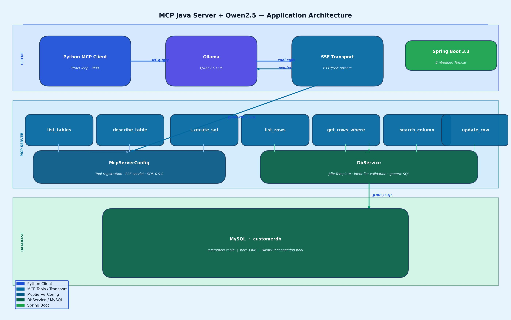
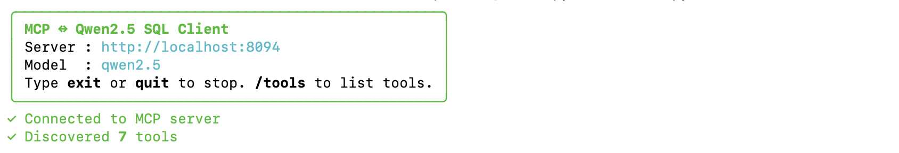
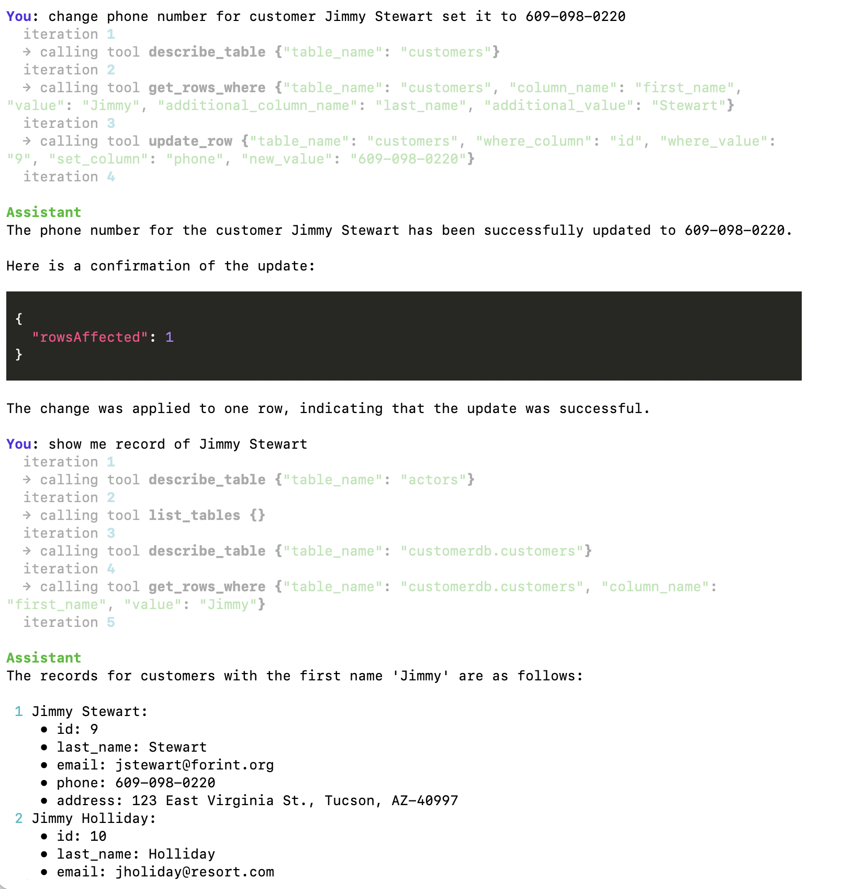

# MCP Java Database Agent

> Talk to any MySQL database in plain English using **Qwen2.5** (via Ollama) and a **Java MCP server** built with the [Model Context Protocol Java SDK](https://github.com/modelcontextprotocol/java-sdk).

Natural-language queries are resolved through a ReAct loop — the LLM discovers your schema at runtime, picks the right tool, and executes read or write operations without any hardcoded table or column names.

---

## Architecture



---

## Prerequisites

| Requirement | Version | Check |
|---|---|---|
| Java | 17+ | `java -version` |
| Maven | 3.9+ | `mvn -version` |
| MySQL | 8.0+ | `mysql --version` |
| Ollama | latest | `ollama --version` |
| Python | 3.11+ | `python3 --version` |

---

## Project Structure

```
.
├── mcp-server/               # Java MCP server (Spring Boot)
│   ├── pom.xml
│   └── src/main/
│       ├── java/com/mcpserverjava/
│       │   ├── McpSqlServerApplication.java   # Spring Boot entry point
│       │   ├── McpServerConfig.java           # Tool registration + SSE transport
│       │   └── DbService.java                 # Generic JDBC operations
│       └── resources/
│           ├── application.yml                # DB connection config
│           └── schema-seed.sql                # Sample schema + data
│
└── mcp-client/                         # Python MCP client
    ├── client.py                        # ReAct loop + interactive REPL
    └── requirements.txt
```

---

## Quick Start

### 1 — Database setup

```bash
mysql -u root -p < mcp-server/src/main/resources/schema-seed.sql
```

Or manually create the table:

```sql
CREATE DATABASE customerdb;
USE customerdb;

CREATE TABLE customers (
    id         INT AUTO_INCREMENT PRIMARY KEY,
    name       VARCHAR(200) NOT NULL,
    email      VARCHAR(320) NOT NULL UNIQUE,
    phone      VARCHAR(30),
    city       VARCHAR(100),
    country    VARCHAR(100) DEFAULT 'US',
    created_at DATETIME     DEFAULT CURRENT_TIMESTAMP,
    is_active  TINYINT(1)   DEFAULT 1
);
```

### 2 — Configure the server

Edit `mcp-server/src/main/resources/application.yml`:

```yaml
spring:
  datasource:
    url: jdbc:mysql://localhost:3306/customerdb
    username: your_user
    password: your_password
```

### 3 — Build and run the server

```bash
cd mcp-server
mvn clean package -q
java -jar target/mcpserverjava-1.0.0.jar
```

Server starts on **http://localhost:8080**.

| Endpoint | Purpose |
|---|---|
| `GET  /sse` | SSE stream — clients subscribe here |
| `POST /mcp/message` | JSON-RPC message endpoint |
| `GET  /actuator/health` | Health check |

### 4 — Pull the Qwen2.5 model

```bash
ollama pull qwen2.5          # ~4 GB, good for most queries
ollama pull qwen2.5:14b      # better accuracy on complex SQL
```

### 5 — Run the Python client

```bash
cd mcp-client
python3 -m venv .venv
source .venv/bin/activate        # Windows: .venv\Scripts\activate
pip install -r requirements.txt

python3 client.py
# optional flags:
# --server http://localhost:8080
# --model  qwen2.5:14b
```

---

## Example Session

```
✓ Connected to MCP server
✓ Discovered 7 tools

You: show me all customers
  → list_tables → describe_table(customers) → list_rows(customers, id)
Assistant: Found 10 customers: Alice Johnson, Bob Smith …

You: find anyone in London
  → search_column(customers, city, London)
Assistant: 1 match — Frank Wilson, frank@example.com, London UK.

You: change Jimmy Stewart's phone to 609-098-0220
  → get_rows_where(customers, name, Jimmy Stewart)   ← confirms row exists
  → update_row(customers, name, Jimmy Stewart, phone, 609-098-0220)
  → get_rows_where(customers, name, Jimmy Stewart)   ← verifies change
Assistant: Updated. Jimmy Stewart's phone is now 609-098-0220 (1 row affected).

You: /tools    ← list all registered MCP tools
You: exit
```



---

## Available MCP Tools

| Tool | Description |
|---|---|
| `list_tables` | List all user tables (system schemas excluded) |
| `describe_table` | Column names, types, nullability for any table |
| `execute_sql` | Safe read-only SELECT — DDL/DML keywords blocked |
| `list_rows` | Paginated scan of any table ordered by any column |
| `get_rows_where` | Exact-match filter on any column of any table |
| `search_column` | Case-insensitive substring search on any text column |
| `update_row` | Update a column value WHERE another column matches |

---

## Configuration Reference

### `application.yml`

```yaml
server:
  port: 8080

spring:
  datasource:
    url: jdbc:mysql://localhost:3306/customerdb
    username: sa
    password: changeme
    hikari:
      maximum-pool-size: 10
      minimum-idle: 2
      connection-timeout: 30000

logging:
  level:
    com.mcpserverjava: DEBUG     # set to INFO in production
```

### `client.py` flags

| Flag | Default | Description |
|---|---|---|
| `--server` | `http://localhost:8080` | MCP server base URL |
| `--model` | `qwen2.5` | Ollama model name |

---

## Security Notes

**Read safety** — `execute_sql` blocks: `DROP`, `DELETE`, `INSERT`, `UPDATE`, `TRUNCATE`, `ALTER`, `EXEC`, `EXECUTE`, `XP_`. Only `SELECT` and `WITH … SELECT` are permitted.

**Identifier injection** — Table and column names cannot be JDBC-parameterised. `DbService` validates every identifier against `[\w.]+` before interpolation. User-supplied *values* are always bound as `?` parameters.

**Principle of least privilege** — Create a scoped database user:

```sql
CREATE USER 'mcp_agent'@'localhost' IDENTIFIED BY 'StrongPass!';
GRANT SELECT, UPDATE ON customerdb.* TO 'mcp_agent'@'localhost';
FLUSH PRIVILEGES;
```

---

## Tech Stack

| Layer | Technology |
|---|---|
| MCP server | Java 17, Spring Boot 3.3, `io.modelcontextprotocol.sdk:mcp:0.9.0` |
| Transport | `HttpServletSseServerTransportProvider` (Servlet SSE, no Spring AI) |
| Database | Spring `JdbcTemplate`, HikariCP, MySQL JDBC 8.x |
| LLM | Qwen2.5 via Ollama (local inference) |
| MCP client | Python 3.11, `mcp` SDK, `ollama`, `rich` |

---

## Extending

Adding a new tool takes three steps:

1. Add a method to `DbService.java` that returns a JSON string.
2. Add a `McpServerFeatures.SyncToolSpecification` in `McpServerConfig.java`.
3. Register it with `server.addTool(yourNewTool())`.

The LLM discovers and uses it automatically on the next client connection — no prompt changes required.

---


## License

MIT
